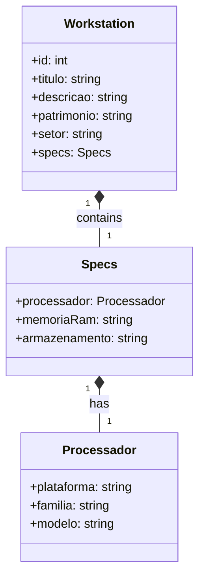

# Projeto API RESTful Java com SpringBoot e Railway

## Diagrama de classes

```mermaid
classDiagram
  class Workstation {
    +id: int
    +titulo: string
    +descricao: string
    +patrimonio: string
    +setor: string
    +specs: Specs
  }

  class Specs {
    +processador: Processador
    +memoriaRam: string
    +armazenamento: string
  }

  class Processador {
    +plataforma: string
    +familia: string
    +modelo: string
  }

  Workstation "1" *-- "1" Specs : contains
  Specs "1" *-- "1" Processador : has
```